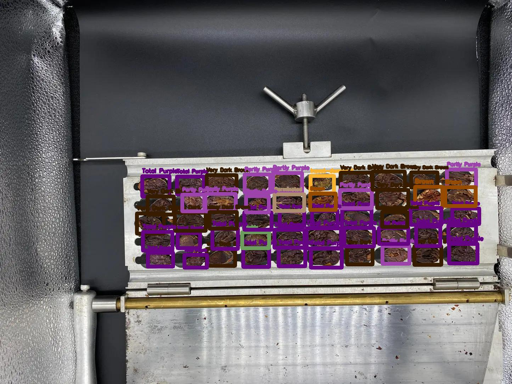
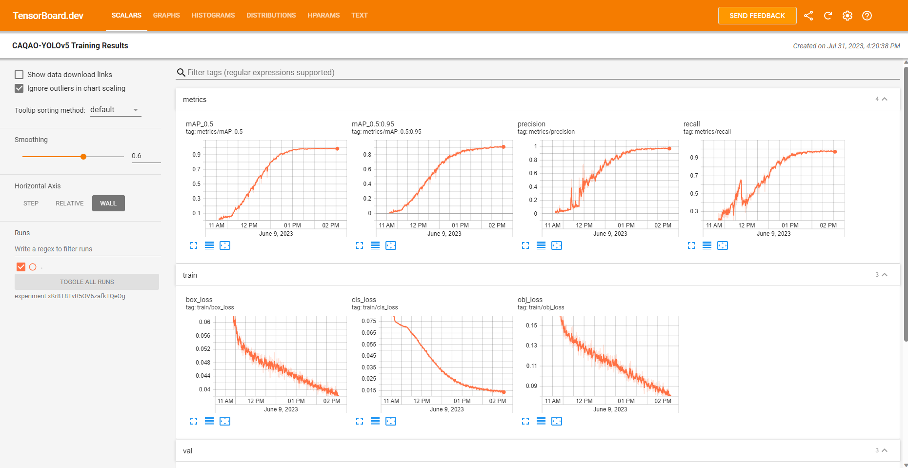
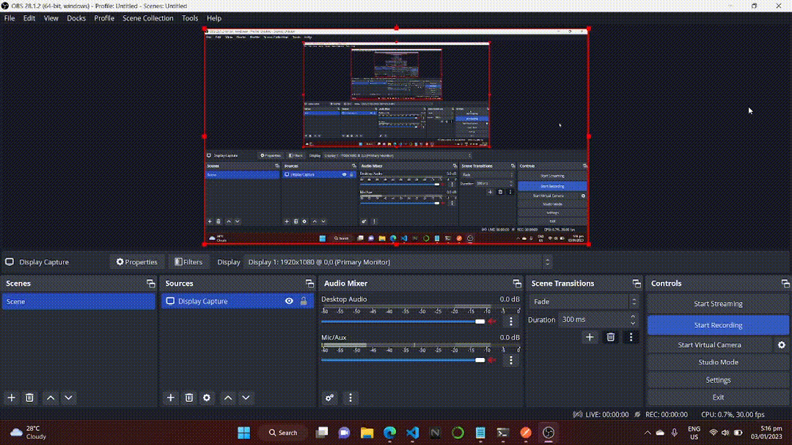

# CAQAO-REST-API
- A Flask-based REST API server for detecting cacao beans in an image using the YOLOv5m model (**mAP50 ~ 0.987**).
- Defines URL endpoint to receive images from the [CAQAO Mobile App](https://github.com/fvea/CAQAO-APP) for cacao beans quality assessment.
- Visual quality assessment of cacao beans during the cut test is based on the [International Standards for the Assessment of Cocoa Quality and Flavour (ISCQF)](https://www.cocoaqualitystandards.org/).

<p align="center">

</p>

## YOLOv5 Object Detection
- The object detection model used is the YOLOv5m model from [Ultralytics](https://github.com/ultralytics/yolov5).
- The model was trained for 1000 epochs. 
- The dataset contains manually collected and annotated images of dried-fermented cacao beans (198 images at 1980x1080 pixels). The dataset is available at [Roboflow](https://universe.roboflow.com/design-project-ueass/caqao-ligthbox/dataset/11).
- Training summary is available and hosted at [Tensorboard](https://tensorboard.dev/experiment/xKr8T8TvR5OV6zafkTQeOg/#scalars&run=.):
<p align="center">

</p>

## Performance Evaluation
The model has a Mean Average Precision at IoU > 0.5 (mAP50) of **0.987** when evaluated on the testing dataset (for all classes):


## REST API
- Flask-based REST API Server is developed to use the model on the [CAQAO Mobile Application](https://github.com/fvea/CAQAO.git).
- An endpoint is defined in ```caqao_app.py``` that receives an image of cacao beans for quality assessment (object detection). The server returns the image with a bounding box and quality classification per cacao bean in the image:
<p align="center">

</p>
